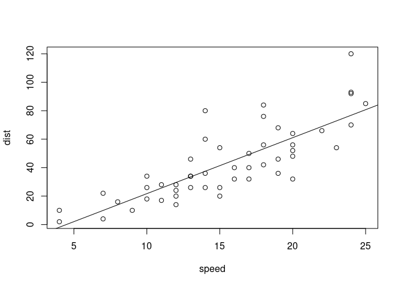

<!-- basic.md is generated from basic.Rmd. Please edit that file -->

# This is a title

This is first Paragraph This is still the first praagraph.

Below is a code chunk:

``` r
fit = lm(dist ~ speed, data = cars)
b   = coef(fit)
plot(cars)
abline(fit)
```

<!-- -->

The slope of the regression is -17.5790949.

## Some math

$$\begin{equation} \label{eq1}
\begin{split}
A & = \frac{\pi r^2}{2} \\
  & = \frac{1}{2} \pi r^2
\end{split}
\end{equation}$$

In R, the character \# indicates a comment.

``` python
import sys
import time
print(sys.version)
t = time.localtime()
current_time = time.strftime("%H:%M:%S", t)
print(current_time)
x = 'hello, python world! wow this is amazing'
print(x.split(' '))
## 3.10.6 (main, Nov 14 2022, 16:10:14) [GCC 11.3.0]
## 16:31:07
## ['hello,', 'python', 'world!', 'wow', 'this', 'is', 'amazing']
```
